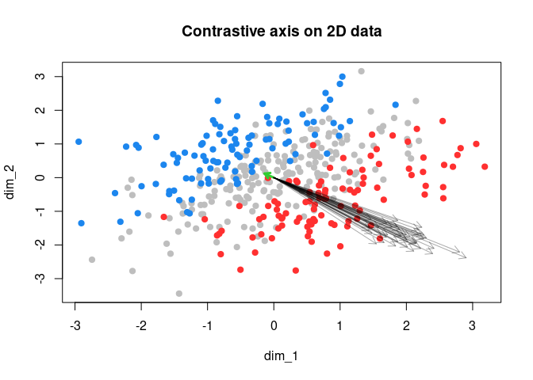
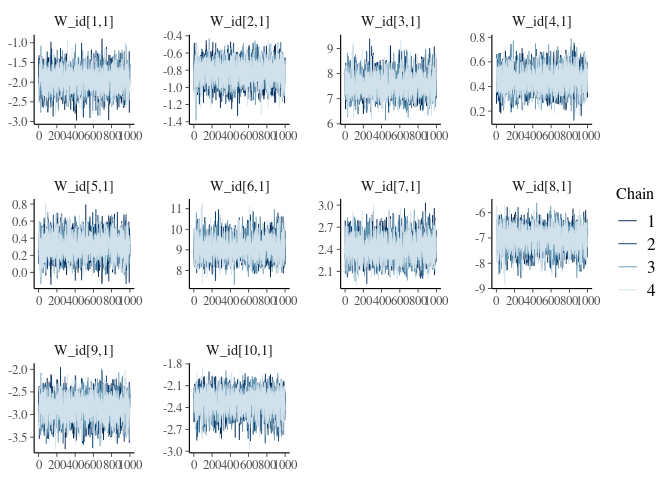
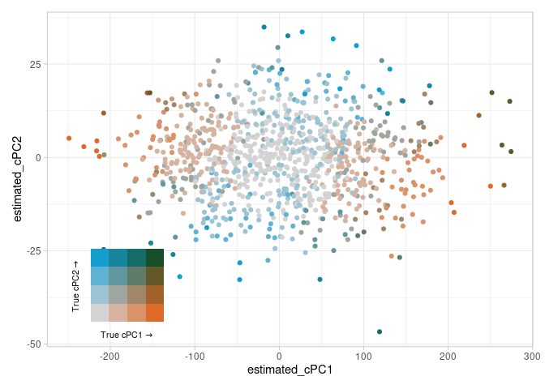

<!-- README.md is generated from README.Rmd. Please edit that file -->

# ezpzmcmcpcpca

R implementation of PCPCA. PCPCA is the work of Didong Li, Andrew Jones,
and Barbara Engelhardt. Original manuscript here:
<https://arxiv.org/abs/2012.07977> and original Python implementation
here: <https://github.com/andrewcharlesjones/pcpca>

The MCMC implementation here is derived from the original Stan code but
uses a few linear algebra identities that make it comparatively faster
(Woodbury matrix inverse, matrix determinant lemma, fast multiply+trace)
and more interpretable (Haar distribution on contrastive axes to ensure
they’re orthogonal).

<!-- badges: start -->
<!-- badges: end -->

## Installation

This package depends on CmdStan & cmdstanr, which are not available via
the usual CRAN route.

``` r
install.packages("cmdstanr", repos = c("https://mc-stan.org/r-packages/", getOption("repos")))

library(cmdstanr)

check_cmdstan_toolchain()

install_cmdstan(cores = 2)

remotes::install_github("andrewGhazi/ezpzmcmcpcpca")
```

If the `cmdstanr` installation doesn’t work you can find more detailed
instructions [at this link](https://mc-stan.org/cmdstanr/).

## Example

The package has two functions `pcpca_mle()` and `pcpca_mcmc()`. The
former directly implements the MLE estimates from the paper. The second
adapts the Gibbs posterior Stan code provided in the original python
implementation.

``` r
library(ezpzmcmcpcpca)

set.seed(123)
mu_vec = c(-.75, .75)
Sigma = matrix(nrow = 2, c(1, .7, .7, 1))

X1 = MASS::mvrnorm(100, 
                   mu = mu_vec,
                   Sigma = Sigma)

X2 = MASS::mvrnorm(100, 
                   mu = -1 * mu_vec,
                   Sigma = Sigma)

Y = MASS::mvrnorm(200, 
                  mu = rep(0,2),
                  Sigma = Sigma)
X = rbind(X1, X2)

plot(rbind(Y, X1, X2),
     pch = 19, 
     col = c(rep('grey', 200), 
             rep('dodgerblue2', 100), 
             rep('firebrick1', 100)),
     xlab = 'dim_1', ylab = 'dim_2',
     main = "Contrastive axis on 2D data")

mle_estimate = pcpca_mle(X,Y, gamma = .85)
#> The first 2 of 2 eigenvalues of C are positive.

# $sigma2_mle
# [1] 0.01181884
# 
# $W_mle
#            [,1]
# [1,] -0.1142008
# [2,]  0.1195985

mcmc_estimate = pcpca_mcmc(X, Y, .85, d = 1,
                           mle_est = mle_estimate, 
                           refresh = 0)
#> Computing MLE estimate to use as initialization point...
#> Running MCMC with 4 sequential chains...
#> 
#> Chain 1 finished in 0.0 seconds.
#> Chain 2 finished in 0.0 seconds.
#> Chain 3 finished in 0.0 seconds.
#> Chain 4 finished in 0.0 seconds.
#> 
#> All 4 chains finished successfully.
#> Mean chain execution time: 0.0 seconds.
#> Total execution time: 0.6 seconds.

W_draws = mcmc_estimate$draws('W', format = 'matrix')[sample.int(4000,40),]

# > mcmc_estimate
#   variable   mean median   sd  mad     q5    q95 rhat ess_bulk ess_tail
#  lp__      -42.85 -42.51 1.31 1.07 -45.41 -41.43 1.00     1269     1860
#  W[1,1]      2.15   2.12 0.30 0.29   1.71   2.70 1.00     1406     1312
#  W[2,1]     -1.98  -1.95 0.29 0.27  -2.50  -1.57 1.00     1384     1329
#  sigma2      0.24   0.23 0.07 0.07   0.15   0.38 1.00     2024     1901
#  ...

arrows(x0 = 0, y0 = 0,
       x1 = mle_estimate$W_mle[1,1],
       y1 = mle_estimate$W_mle[2,1], 
       col = "limegreen", length = .075, lwd = 3)
arrows(x0 = 0, y0 = 0,
       x1 = W_draws[,1],
       y1 = W_draws[,2], 
       col = rgb(0,0,0,.333), length = .1)
```



# Identifiability

It also works for higher numbers of latent dimensions. The simulation
below explicitly defines two contrastive axes (`W_rand`), but one could
also simply create multiple groups in X with varying mean.

A note on identifiability. The sign of the contrastive axes are not
identifiable. Axes pointing like this `┘` have the same posterior
density as axes flipped to point like this `┌`.

To help get around this, we produce a generated quantity variable `W_id`
that dots each axis onto the MLE and if it’s negative multiplies by -1.
This works well if there is sufficient data, and the convergence metrics
of `W_id` (particularly Rhat) will be happy. Higher numbers of latent
dimensions requires more data for clear inference.

Nonetheless, this doesn’t always work. If you notice component(s) of
`W_id` that seem to be symmetrically flipping about zero, that means
there’s substantial probability that the posterior mean isn’t pointing
in the right direction. This diagnostic use is one of the main
advantages of the MCMC approach.

``` r
library(ezpzmcmcpcpca)
library(biscale)
library(tidyverse)
library(patchwork)

set.seed(123)
p = 10
k = 2

# more variance along the second axis
W_rand = matrix(rnorm(p*k), ncol = k) %*% diag(c(2,.75)); W_rand
#>             [,1]        [,2]
#>  [1,] -1.1209513  0.91806135
#>  [2,] -0.4603550  0.26986037
#>  [3,]  3.1174166  0.30057859
#>  [4,]  0.1410168  0.08301204
#>  [5,]  0.2585755 -0.41688085
#>  [6,]  3.4301300  1.34018485
#>  [7,]  0.9218324  0.37338786
#>  [8,] -2.5301225 -1.47496287
#>  [9,] -1.3737057  0.52601693
#> [10,] -0.8913239 -0.35459356

cor_mat = trialr::rlkjcorr(1, p, 1);

Y = MASS::mvrnorm(n = 1000, mu = rep(0,p),
                  Sigma = cor_mat)

contrastive_noise = MASS::mvrnorm(n = 1000,
                                  Sigma = diag(k),
                                  mu = rep(0,k))

contrastive_variation = (contrastive_noise %*% t(W_rand))

X = MASS::mvrnorm(n = 1000, Sigma = cor_mat,
                  mu = rep(0,p)) +
  contrastive_variation


res_mle = pcpca_mle(X, Y, .85, 2); res_mle
#> $sigma2_mle
#> [1] 0.001184855
#> 
#> $W_mle
#>              [,1]          [,2]
#>  [1,] -0.06325072  0.0952025428
#>  [2,] -0.02708875  0.0281103001
#>  [3,]  0.24924615 -0.0406857222
#>  [4,]  0.01496209 -0.0037119577
#>  [5,]  0.01005678 -0.0359703063
#>  [6,]  0.29977329  0.0305903834
#>  [7,]  0.07953591 -0.0006342779
#>  [8,] -0.23167991 -0.0650611589
#>  [9,] -0.09403848  0.0733035177
#> [10,] -0.07706104 -0.0005372498
res_mcmc = pcpca_mcmc(X, Y, .85, 2, 
                      mle_est = res_mle,
                      chains = 4,
                      parallel_chains = 4, refresh = 0,
                      show_messages = FALSE)

res_mcmc$summary(c("sigma2", "W_id"))
#> # A tibble: 21 × 10
#>    variable    mean median     sd    mad      q5    q95  rhat ess_bulk ess_tail
#>    <chr>      <num>  <num>  <num>  <num>   <num>  <num> <num>    <num>    <num>
#>  1 sigma2     1.21   1.21  0.0495 0.0494  1.13    1.29   1.00    3605.    2629.
#>  2 W_id[1,1] -1.93  -1.92  0.290  0.284  -2.41   -1.47   1.00    3888.    3088.
#>  3 W_id[2,1] -0.823 -0.820 0.126  0.128  -1.03   -0.625  1.00    4458.    3471.
#>  4 W_id[3,1]  7.57   7.53  0.444  0.435   6.88    8.31   1.00    3856.    2818.
#>  5 W_id[4,1]  0.454  0.454 0.0914 0.0925  0.305   0.606  1.00    4960.    3249.
#>  6 W_id[5,1]  0.309  0.308 0.133  0.130   0.0928  0.528  1.00    3844.    3277.
#>  7 W_id[6,1]  9.10   9.08  0.523  0.513   8.28    9.99   1.00    3920.    2899.
#>  8 W_id[7,1]  2.41   2.40  0.162  0.161   2.16    2.69   1.00    3910.    3279.
#>  9 W_id[8,1] -7.03  -7.01  0.443  0.437  -7.79   -6.34   1.00    4068.    2774.
#> 10 W_id[9,1] -2.86  -2.85  0.268  0.263  -3.32   -2.44   1.00    3892.    3041.
#> # ℹ 11 more rows

# Look at the first component
res_mcmc$draws('W_id', format = 'matrix')[,1:10] |>
  bayesplot::mcmc_trace() 
```



``` r

contrastive_magnitude = sqrt(rowSums(contrastive_noise^2))
pal_fun = colorRampPalette(c('grey', 'red'))

contrast_cols = pal_fun(20)[cut((contrastive_magnitude / max(contrastive_magnitude)),
                                breaks = 20) |> as.numeric()]

plot_data = (rbind(X) %*% matrix(res_mcmc$summary("W_id")$mean, ncol = 2)) |> 
  as_tibble() |>
  set_names(c('x', 'y')) |> 
  bind_cols(contrastive_noise |> as_tibble()) |> 
  mutate(across(V1:V2, abs))
#> Warning: The `x` argument of `as_tibble.matrix()` must have unique column names if
#> `.name_repair` is omitted as of tibble 2.0.0.
#> ℹ Using compatibility `.name_repair`.
#> This warning is displayed once every 8 hours.
#> Call `lifecycle::last_lifecycle_warnings()` to see where this warning was
#> generated.

bivar_plot = plot_data |>
  mutate(bc = biscale::bi_class(plot_data ,
                                x = V1,
                                y = V2,
                                dim = 4, 
                                style = 'equal')$bi_class) |> 
  ggplot(aes(x,y)) +
  geom_point(aes(color = bc), show.legend = FALSE) + 
  bi_scale_color(pal = 'BlueOr', 
                 dim = 4)  +
  labs(x = "estimated_cPC1",
       y = "estimated_cPC2") + 
  theme_light()

bivar_leg = bi_legend('BlueOr', dim = 4,
                      xlab = 'True cPC1', 
                      ylab = 'True cPC2')  + 
  theme(plot.background = element_blank(), 
        panel.background = element_blank(),
        text = element_text(size = 8))

bivar_plot + inset_element(bivar_leg, -.05, 0, .35, .35)
```



``` r

plot(W_rand[1:(p*k)], matrix(res_mcmc$summary("W_id")$mean, ncol = 1), 
     col = c(rep('blue', 10), rep('red', 10)),
     pch = 19, 
     xlab = 'true axis components', ylab = 'posterior means', 
     main = "True vs estimated axis components")
legend(2.25, -2, c('axis 1', 'axis 2'), col = c("blue", "red"), pch = 19)
```


# Future goals

- Infer gamma probabilistically (likely requires a strong prior)
- further speedups (lowest hanging fruit at this point is probably to
  avoid forming the full pxp matrix in `woodbury()` by also passing in C
  and only keeping track of the differences)
